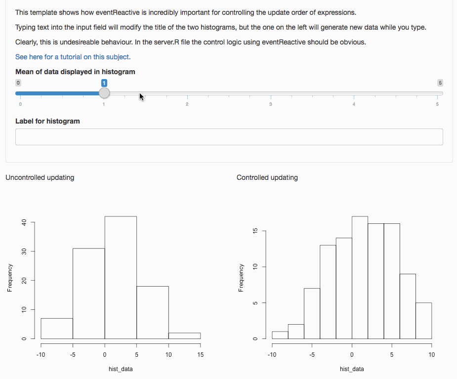

# Reactive Expressions

This is a minimal template Shiny app to show how to control how and when output is updated. It's difficult to explain the example in words without getting techical, hopefully the GIF below helps

# Using this template

This template is thoroughly [documented here](https://ox-it.github.io/OxfordIDN_Shiny-App-Templates/advanced-shiny-features/reactive-expressions/).

To obtain a copy of the code, click this link to [download a zip of the necessary files](https://minhaskamal.github.io/DownGit/#/home?url=https://github.com/ox-it/OxfordIDN_Shiny-App-Templates/tree/gh-pages/advanced-shiny-features/reactive-expressions/shiny-app).

# License

This code is distributed under a CC0 license - all rights are waived. Note that other templates in this collection may have different licenses.

